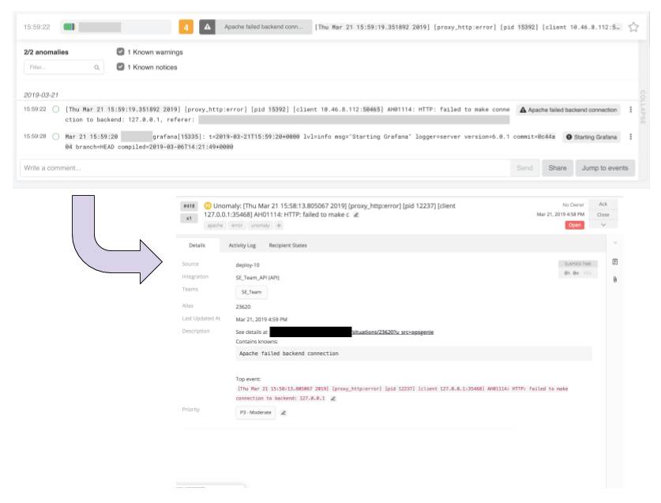

# unomaly-plugin-opsgenie

This action plugin for [Unomaly](https://unomaly.com/) creates alerts in
OpsGenie.

## Installation

Create the npm package (`make build`) and upload the .tgz to
`/DATA/plugins/js/load/` folder, so that Unomaly automatically loads the plugin.

## Configuration

This plugin provides per OpsGenie service region configuration, so make sure to
configure the correct API URL, depending on the location of your OpsGenie
account.
